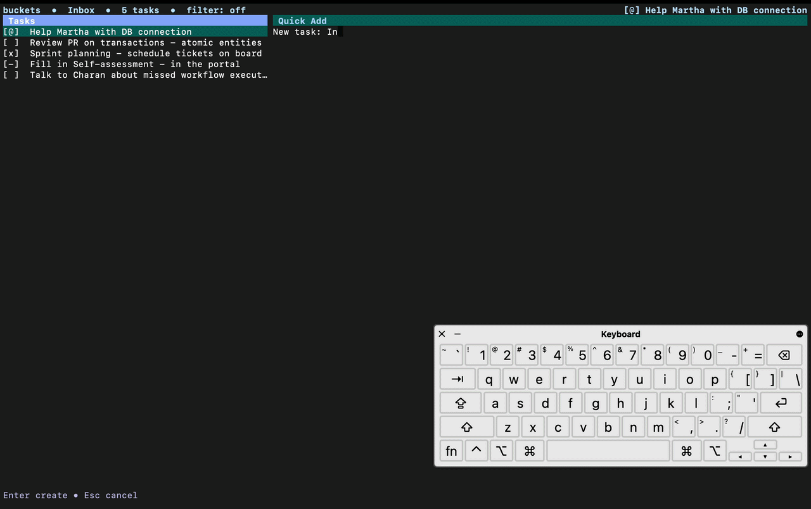

# bucket

> A keyboard-first terminal task manager for people who get interrupted all day.

`bucket` helps you get tasks out of your head fast. Capture requests as they arrive, keep moving, and come back later to process them from a fast two-pane TUI without reaching for the mouse.



## Why bucket

- Quick capture: press `a`, type a title, press `Enter`
- Keyboard-only workflow: list navigation, task editing, filtering, status updates
- Local-first storage with SQLite under `~/.config/bucket/`
- Safer editing with autosaved drafts and conflict recovery
- Practical task detail fields: notes, subtasks, URLs, due date, priority, estimate, progress

## Core flow

1. Run `bucket`
2. Press `a`, type a title, press `Enter`
3. Press `Enter` or `l` to open details
4. Use `Tab` or `ctrl+t/u/s/d/p/e/r/b/n` to move across fields
5. Press `Esc` or `ctrl+h` to return to the list

## Keyboard highlights

### Main list

- `j` / `k` or `↓` / `↑`: move
- `Space`: cycle status
- `/`: filter by title
- `o`: open URL
- `I / U / A / C / @`: switch list view
- `q` / `ctrl+q` / `ctrl+c`: quit

### Edit view

- `Tab` / `Shift+Tab`: next/previous field
- `ctrl+space` (or `ctrl+@`): cycle status
- `ctrl+o`: open URL
- `ctrl+k`: clear URL when the URL field is focused

## Install

### macOS release

Install the latest release:

```sh
curl -fsSL https://raw.githubusercontent.com/suyash-sneo/bucket/master/scripts/install.sh | sh
```

Install a specific version:

```sh
curl -fsSL https://raw.githubusercontent.com/suyash-sneo/bucket/master/scripts/install.sh | BUCKET_VERSION=v0.0.1 sh
```

### Build from source

For macOS, Linux, and Windows source builds, see [docs/build-source.txt](docs/build-source.txt).

## Uninstall (macOS)

Remove binary and data:

```sh
curl -fsSL https://raw.githubusercontent.com/suyash-sneo/bucket/master/scripts/uninstall.sh | sh
```

Remove the binary but keep local data:

```sh
curl -fsSL https://raw.githubusercontent.com/suyash-sneo/bucket/master/scripts/uninstall.sh | BUCKET_KEEP_DATA=1 sh
```

## Data and config

Bucket stores local state in `~/.config/bucket/`:

- Config: `~/.config/bucket/config.yml`
- Logs: `~/.config/bucket/log.txt` (capped; default 10 MB)
- Database: `~/.config/bucket/bucket.db`
- Drafts: `~/.config/bucket/drafts/`
- Migration backups: `~/.config/bucket/backups/`

## Documentation

- [Build from source](docs/build-source.txt)
- [Configuration](docs/config.txt)
- [Draft and conflict handling](docs/conflict-management.txt)
- [Contributing](CONTRIBUTING.md)

## Contributing

See [CONTRIBUTING.md](CONTRIBUTING.md) for contribution workflow.

Help wanted: Linux and Windows build validation, runtime testing, and issue reports from real environments.

## License

MIT. See [LICENSE](LICENSE).
